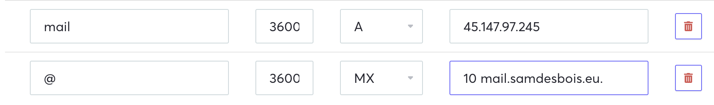

Title: Je crée un nouveau serveur mail
Date: 2023-09-28
Modified: 2023-09-29
Category: Informatique
Tags: email, linux

Dans ma quête de perte de temps, je vais essayer d'héberger mes mails, mais 
sur 
mon serveur de nouveau, c'est-à-dire ne pas passer par un fournisseur de 
boîte mail dont le plus connu reste *gmail* avec ses quelque 1,5
milliards de comptes actifs, tout en sachant qu'il y aurait 1,7 de comptes 
(toute messagerie confondue) par humain.[^1]

J'utilise le tuto officiel[^2] pour installer la solution alléchante sur le 
papier (car utilise le système Docker) : **Docker MailServer** ou DMS.

Je ne vais pas paraphraser le tuto, mais vais seulement indiquer les petites 
astuces lorsque j'étais bloqué. J'ai essentiellement fait des 
allers-retours entre le tuto ci-dessus et la documentation[^3] de mon 
hébergeur de serveur : [pulseheberg](https://pulseheberg.com).

## La partie DNS
J'ai un peu galéré avec mon fournisseur, concernant la parie *MX*,  car il 
faut ajouter dans la case finale la priorité de la requête 
(j'ai choisi 10, parce que c'est ce que je vois le plus dans les billets). 
J'ai rajouté un `.` à la fin de l'adresse pour que ce soir plus propre lors 
des retours d'adresse. Sinon l'adresse apparaît deux fois dans le retour.



## Le certificat (TLS)

J'utilise le bien pratique programme *certbot* pour installer les 
certificats nécessaires selon le protocole recommandé. Pour cela, j'éteins 
temporairement *apache2* pour pouvoir utiliser le port 80. Pas besoin de 
faire cela j'imagine si vous n'hébergez pas un site sur votre machine :

```sh
sudo service apache2 stop
# Some other commands...
sudo service apache2 start
```

## Général

Personnellement, je n'utilise pas la commande de lancement de l'application 
générale recommandée par le tuto de **Docker Mailserver**, mais celle-ci :

```sh
docker-compose -f ./compose.yaml up -d
```

## Conclusion
J'ai un peu galéré sur 24 heures, seulement. Ça marche pourtant, et c'est 
magique si on 
considère que les emails sont une antiquité d'Internet et que 
l'installation de son propre serveur est fortement déconseillée. [^4] C'est 
agréable de tester sa propre adresse email qui a un meilleur score que 
celle sur gmail.

La chose qui manque vraiment à une utilisation personnelle est le système 
de sauvegarde. C'est peut-être un futur mini projet !

[^1]: [arobase.org - 27 septembre 2023](https://www.arobase.org/actu/chiffres-email.htm)

[^2]: [docker-mailserver.github.io - 27 septembre 2023](https://docker-mailserver.github.
io/docker-mailserver/latest/usage/)

[^3]: [docs.pulseheberg.com](https://docs.pulseheberg.com/fr/)

[^4]: [Why You May Not Want To Run Your Own Mail Server](https://www.digitalocean.com/community/tutorials/why-you-may-not-want-to-run-your-own-mail-server)

[^5]: [mail-tester.com](https://www.mail-tester.com/)