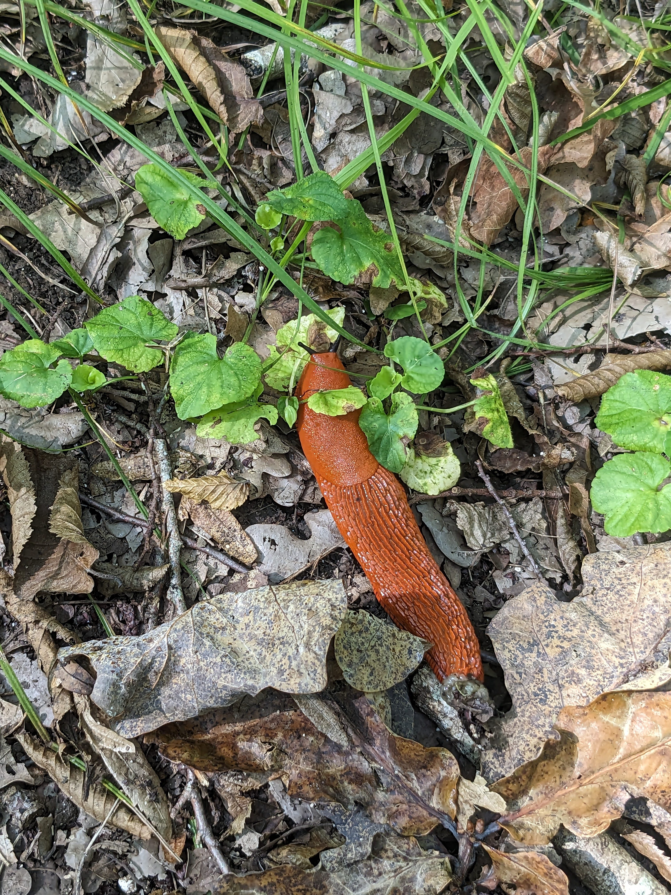

Title: Je suis parti fâché courir
Date: 2023-08-21
Modified: 2023-08-22
Category: Perso
Tags: Châtillon-Sur-Seine, parcours, santé, forêt, randonnée
Summary: Petit évènement de vie sur parcours de santé un jour de canicule.

Personne ne voulait venir avec moi. J'ai fait du chantage en vain. Je suis donc parti avec le chien, le seul qui ne puisse pas refuser de me suivre. Je me suis dirigé vers le parcours santé de la forêt municipale de la ville de Châtillon-Sur-Seine. C'est à quelques minutes de voiture, mais au moins l'emplacement sur le GPS est le bon cette fois-ci. J'arrive sur le petit parking au cœur de la forêt. Il y a quelques voitures déjà parquées. Je ne suis ainsi pas le seul à avoir cette idée par canicule. J'envoie un message de reproches à la maison avec vidéo à l'appui.

Je demande à une femme, qui attendait assise là je ne sais quoi, un peu plus âgée que moi où pourrait se trouver le début du parcours. Elle me l'indique avec le sourir. Je le trouve et nous nous lançons, moi et mon chien, en mode jogging détente sur le sentier aménagé. Il a été inauguré en 2010 seulement à ce que j'ai pu lire à son entrée.

Régulièrement, il y a des installations en bois pour effectuer certains exercices comme les abdominaux seuls, le saute-mouton ou les barres parallèles. Je me prête aux exercices lorsque je ne rencontre pas d'autres semblables qui pourraient m'observer. Le chien lui est râvi. Il fait des vas et viens pour s'adapter à mon rythme, car le sien est d'une autre catégorie.

Nous rencontrons une deuxième famille que nous dépassons puisqu'elle marchait. Le hic est qu'ils ont un chien. Cela ne râte pas. Le mien dresse le poil et se met donc en mode attaque. Moi, je continue comme il m'a été conseillé sur une vidéo de dressage. Par contre, cette gentille peite famille montre quelques signes de panic en se précipitant vers les chiens en vociférant le nom du leur. Tout ce qu'il ne faut pas faire. Je dois utiliser le collier de dressage en mode électricité pour que le mien daigne me suivre. Depuis quelque temps, il ne peut s'empêcher de chercher la bagarre.

J'arrive à la fin du parcours qui ne doit pas faire plus d'un kilomètre. À la sortie, je repère le début du parcours du chevreuil, celui que je cherchais initialement. Ce sera pour une prochaine fois. J'ai l'impression dêtre à mon parking, mais en fait, c'est un deuxième qui ressemble au premier à s'y méprendre. Je dois faire quelques dizaines de mettre sur la route goudronnée pour rejoindre celui où ma voiture se trouve. Lorsque je m'engage dans celui-ci une petite voiture citadine venait d'y rentrer et je devine un nouveau congénère à quatre pattes à côté de la conductrice. La voiture est immatriculée espagne. Je me fais la réflexion qu'elle ne doit pas être une fan de football, car la finale de la coupe du monde féminine entre l'Espagne et l'Angleterre se déroule actuellement. C'est cette raison que je me presse de rentrer, parce que je souhaite regarder le match à la télévision.

Le chien, qui s'avère être un teckel est en liberté, comme le mien. Ils se rapprochent lun de l'autre. Cela repart en bagarre, mais j'ai moins de mal à le rappeler à moi. Le souvenir de la correction précédente est encore vivace :

-C'est un mâle, me dit la grande femme blonde d'une cinquantaine d'année.

-Oui, répondis-je sans plus épiloguer.

J'ai probablement été décontenancé par son accent. Il n'a rien d'ibérique. Nous rentrons dans ma voiture puis nous commençons à rouler au pas. Au niveau de la dame que je devais croiser de nouveau pour sortir du parking, je baisse ma vitre électrique :

-C'est un mâle aussi le vôtre ?

-Oui pourquoi ?

-C'est vous qui m'aviez demandé à cause de la bagarre. Votre accent n'a rien d'espagnole.

-Oui je suis allemande.

Nous nous souhaitons chacuns une bonne journée et nous chemins se séparent. Cette dame était pleine de surprises. Un point final à ma promenade agréable.

{: .image-process-article-image}
