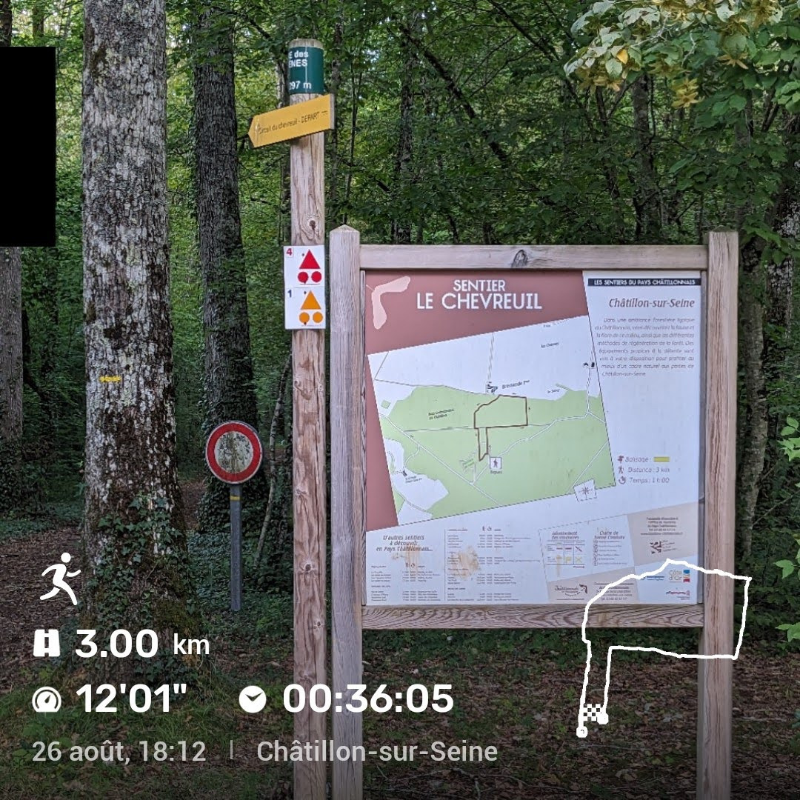

Title: Conseils sur le Sentier Le Chevreuil
Date: 2023-08-27
Category: Randonnée

Lorsque je cherche des informations sur une randonnée du coin, je passe 
généralement par Google©. Je bouge pas mal et n'ai pas comme qualité de me 
faire des amis facilement. Je n'ai donc d'autre choix que de faire une 
recherche sur Internet. Et là, je tombe des nus. J'ai toujours la 
conviction que l'on trouve tout ce que l'on veut sur la toile. Encore une 
fois, je suis déçu. Ce n'est pas pour cela que je garde grand espoir dans ce 
réseau. Tout ça pour dire que je n'ai pas trouvé d'information pertinente 
pour **le sentier le chevreuil** à *Châtillon-Sur-Seine* dans le 21. Cet 
article va donc permettre de corriger cette lacune pour toi l'internaute qui 
ne sait pas trop quoi faire de son samedi dans cet endroit pommé.

Ce sentier est dans la forêt communale de la ville citée ci-dessus. Le 
mieux est de chercher sur Google Map le *"parcours de santé"* qui se trouve 
à côté. Lorsque vous quittez ce qui doit être une départementale pour vous 
y rendre en tournant à droite, le premier parking correspond au parcours de 
santé. Il suffit de continuer pour prendre le deuxième parking d'où par le 
sentier le chevreuil.

C'est assez rapide à faire en trottinant. Je n'ai malheureusement rencontré 
ni chevreuil, ni sanglier. C'est seulement en reprenant la route du retour, 
en voiture, que nous avons croisé trois jeunes chevreuils au bord de 
celle-ci. Cette départementale, qui passe au milieu de la forêt, crée une 
lisière artificielle. Comme il était écrit sur un panneau informatif sur le 
chevreuil, cet animal se rencontre souvent à la lisière des forêts ou 
bosquets. C'est également un animal vespéral ou nocturne. Entre le moment 
de la photo, et la rencontre, 1 heure était passée, plus ou moins. Il 
n'était pas loin de 20h00. Ces deux 
critères ont été remplis et nous avons eu cette chance.

