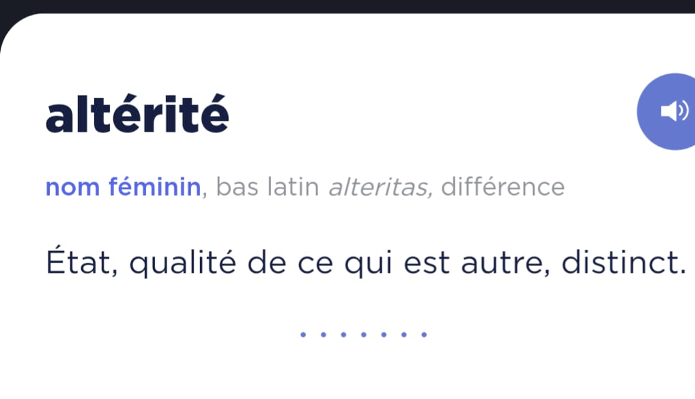

Title: Se sentir vivre
Date: 2024-10-12
Category: perso
language: fr
Tags: blog, altérité
Status: Published

J'appréhende les week-ends. J'ai toujours peur de ne pas profiter de mon 
week-end, mais j'ai du mal à savoir comment faire dans la pratique. Est-ce 
que je dois aller voir le film du moment, pratiquer beaucoup de sport ou 
voir des amis ? Je n'ai pas la réponse, toutefois un début de piste. Écrire 
ce billet, qui ne rentrera pas dans les annales d'Internet, me fait me sentir 
un peu plus vivant, c'est-à-dire de ne pas avoir l'impression de gâcher 
totalement mon week-end.

