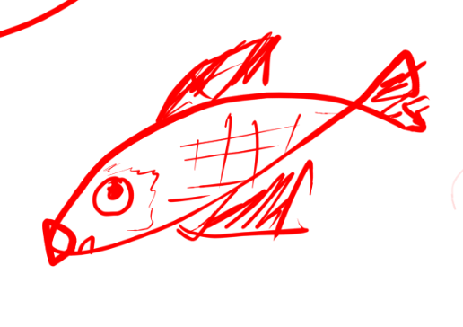

Title: Un livre d'aquariophilie
Date: 2024-11-03
Category: aquariophilie
language: fr
Tags: aquarium, aquariophilie, livre

Je ne pense pas avoir lu un seul livre sur l'aquariophilie. J'ai tout 
découvert sur le tas ou plus exactement j'ai gaspillé beaucoup de temps et 
d'argent parce que je ne savais tout simplement pas.

J'ai pourtant pris du plaisir à cette passion et j'y suis toujours aujourd'hui.

Ce livre à cela d'intéressant qu'il semble avoir été écri par une 
scientifique. On est loin de la science dure, mais ce livra a au moins le 
mérite de s'appuyer sur quelques études. Je ne pense pas qu'il ait été 
traduit en français. Son titre : **Ecology of the Planted Aquarium: A 
Practical Manual and Scientific Treatise**.