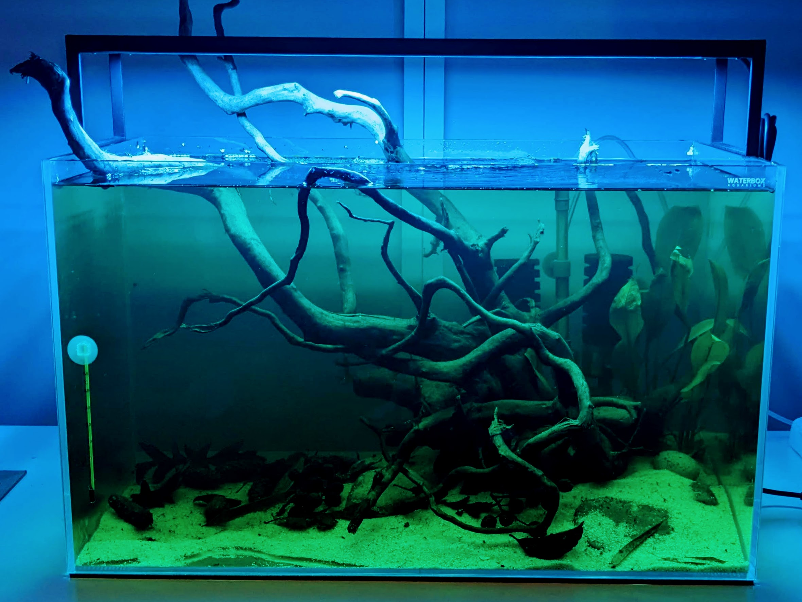

Title: Un nouvel aquarium
Date: 2024-02-18
Category: aquariophilie
language: fr
Tags: waterbox, biotope, rio negro, Chihiros, WRGB

J'ai une passion dont je ne vous ai jamais soûlé avec : l'aquariophilie. 
Partout où je pose un tant soit peu ma valise, je crée un aquarium. Cet 
intérêt a commencé lorsque j'étais encore au collège. Sur le chemin du 
retour, qui était bien long, je rentrais dans un magasin spécialisé. Je 
n'ai aps le souvenir d'avoir une seule fois adressé la parole au gérant. Je 
ne me rappelle même pas son visage. Probablement, que je ne le dérangeais 
pas trop vu le temps que j'ai passé là-bas. C'était plus de la 
contemplation que de l'observation scientifique, car je n'y ai rien appris
vu les erreurs commises par la suite.

En passant, ce n'est sûrement pas dans un magasin que vous apprendrez 
grand-chose. Il ne faut pas oublier qu'un commerce de poissons d'ornement reste 
un commerce. Le but est de vendre. C'est une passion qui peut avoir un coût.
Il est très probablement possible d'acheter tous les poissons ou les 
plantes chez des particuliers. Cela permet une petite économie, un échange 
de connaissance toujours bonne à prendre et surtout de s'assurer que les 
poissons tropicaux sont issus de l'élevage et non extrait du milieu naturel.
Internet rend la mise en relation vraiment aisée, notamment avec les sites 
de petites annonces.

Alors je vous présente mon nouvel aquarium qui n'a que 10 jours et qui donc 
n'a aucun poisson ou invertébrés puisque le célèbre cycle de l'azote n'est 
pas encore en place. C'est assez dur de résister à l'envi de mettre 
quelques êtres mobiles. Sans plus tarder, je vous présente ce projet sur 
cuve de 64 litres en verre extra-clair et une lampe led Chihiro WRGB slim 2 
de 60 cm pour le côté matériel. L'idée est de se rapprocher du *biotope* 
**rio negro** d'Amérique du Sud.

